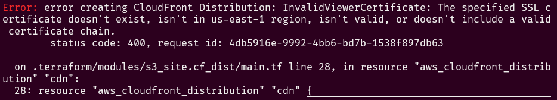

# Terraform AWS S3-hosted Static Site

This Terraform module deploys an S3-hosted static site with HTTPS enabled.

## Resources

- S3 bucket to deploy files.
- CloudFront distribution fronting the bucket to provide an SSL connection.
- Route 53 hosted zone for the BYU sub-domain with records to the CloudFront distribution
- ACM certificate for the URL

## Usage
```hcl
module "s3_site" {
  source    = "github.com/byu-oit/terraform-aws-s3staticsite?ref=v6.0.0"
  site_url       = "my-site.byu.edu"
  hosted_zone_id = "zoneid"
  s3_bucket_name = "bucket-name"
  tags = {
    "tag" = "value"
  }
}
```

**Note**: Using this module will require you to run `terraform apply` twice. The first time it will create the Route 53 hosted zone, certificate in ACM, and S3 bucket for deployment. Then it will fail because AWS can't validate the certificate (you'll get an error message similar to the image below). You need to contact the network team to setup a record in QIP for your desired subdomain name pointing to the name servers of the hosted zone created by Terraform (you can find that information in the Route 53 console). After AWS has validated the certificate (you can find that information in the ACM console), run `terraform apply` again and it should succeed.

**First Terraform Error**


## Inputs
| Name                   | Type        | Description                                                                       | Default        |
| ---------------------- | ----------- | --------------------------------------------------------------------------------- | -------------- |
| hosted_zone_id         | string      | Hosted Zone ID                                                                    |
| index_doc              | string      | The index document of the site.                                                   | index.html     |
| error_doc              | string      | The error document (e.g. 404 page) of the site.                                   | index.html     |
| origin_path            | string      | The path to the file in the S3 bucket (no trailing slash).                        | *Empty string* |
| site_url               | string      | The URL for the site.                                                             |
| wait_for_deployment    | bool        | Define if Terraform should wait for the distribution to deploy before completing. | `true`         |
| s3_bucket_name         | string      | Name of S3 bucket for the website                                                 |
| tags                   | map(string) | A map of AWS Tags to attach to each resource created                              | {}             |
| cloudfront_price_class | string      | The price class for the cloudfront distribution                                   | PriceClass_100 |
| cors_rules             | list(object) | The CORS policies for S3 bucket                                                  | []             |
| forward_query_strings  | bool         | Forward query strings to the origin.                                             | `false`        |
| log_cookies            | bool         | Include cookies in the CloudFront access logs.                                   | `false`        |
| force_destroy          | bool         | Destroy site buckets even if they're not empty on a `terraform destroy` command. | `false`
| waf_acl_arn            | string       | The ARN of the WAF that should front the CloudFront distribution.                |
## Outputs
| Name            | Type                                                                                                     | Description                                             |
| --------------- | -------------------------------------------------------------------------------------------------------- | ------------------------------------------------------- |
| site_bucket     | [object](https://www.terraform.io/docs/providers/aws/r/s3_bucket.html#attributes-reference)              | The deployed S3 bucket.                                 |
| cf_distribution | [object](https://www.terraform.io/docs/providers/aws/r/cloudfront_distribution.html#attribute-reference) | The deployed CloudFront distribution.                   |
| dns_record      | [object](https://www.terraform.io/docs/providers/aws/r/route53_record.html#attributes-reference)         | The DNS A-record mapped to the CloudFront Distribution. |
